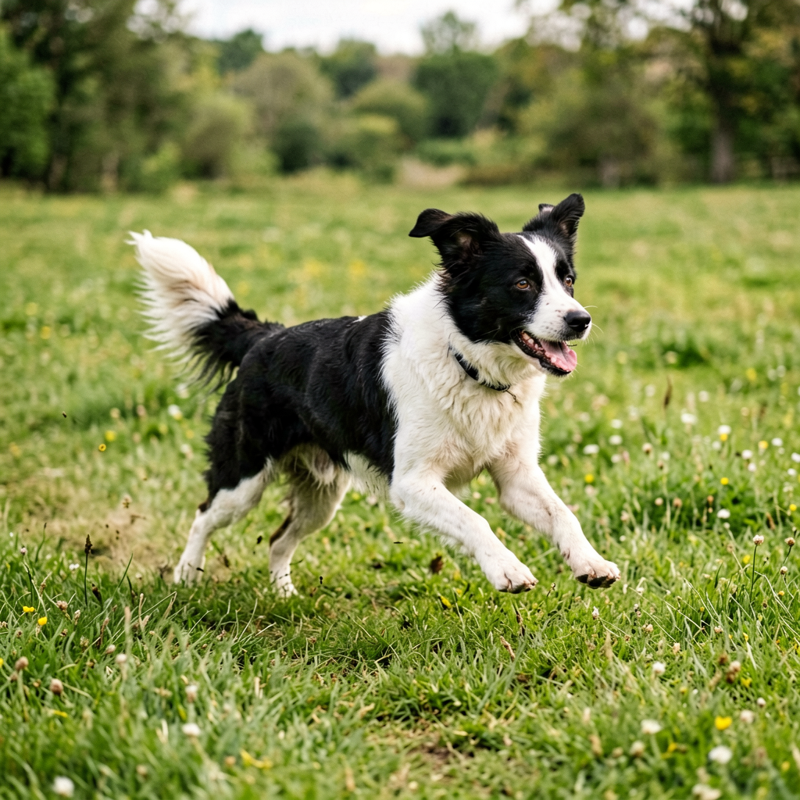
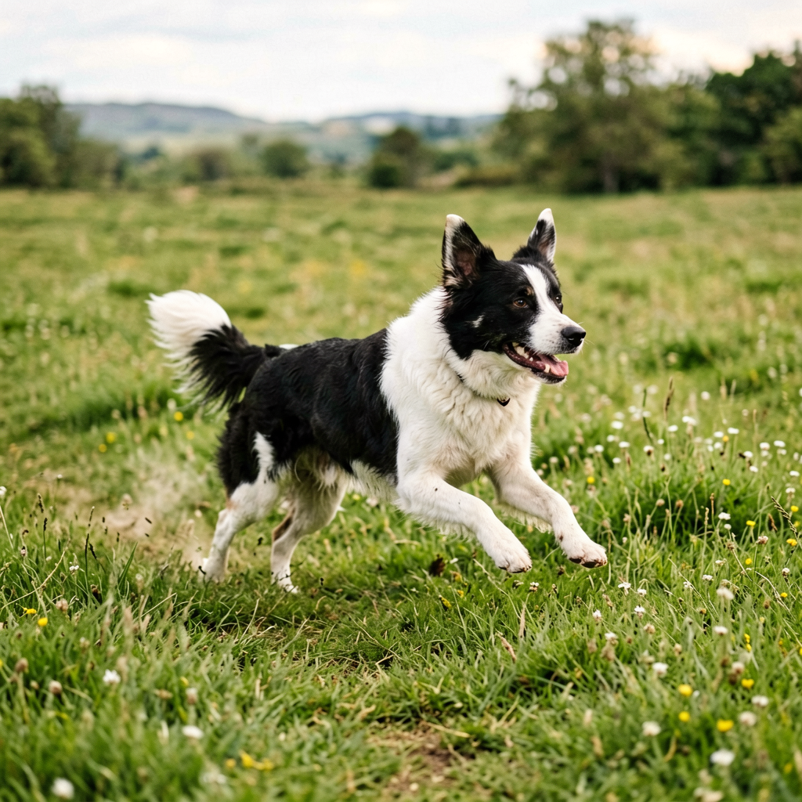
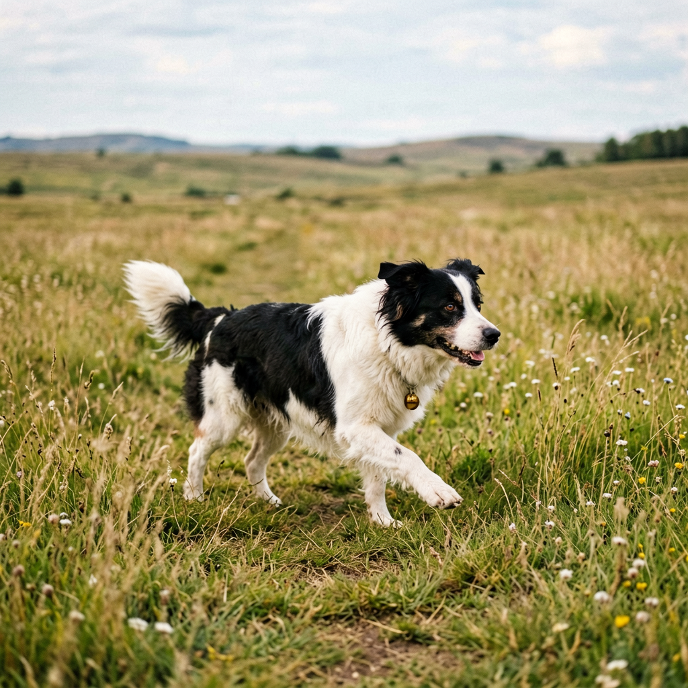
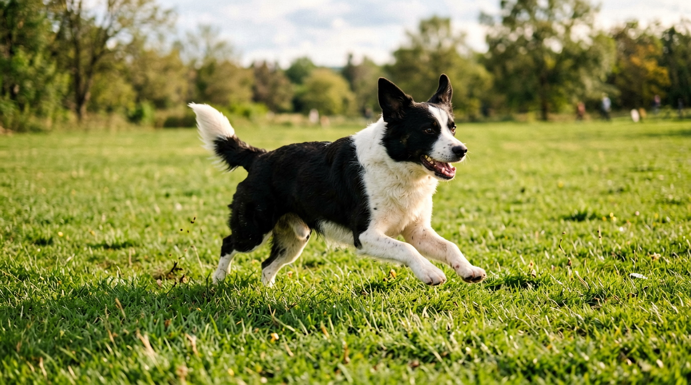
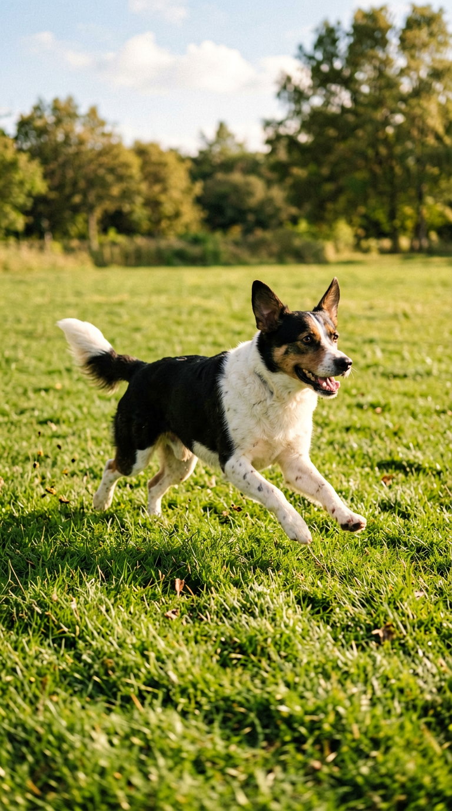

# ERNIE-Image-Vulkan

基于 [`baidu/ERNIE-Image-Turbo`](https://huggingface.co/baidu/ERNIE-Image-Turbo) 的 C++/ncnn 文生图实现，支持 ncnn CPU 与 Vulkan 后端。下载转换后的模型权重后，推理过程可在 Linux 环境中独立运行。

项目代码：<https://github.com/everythingfornothing/ernie-image-ncnn-vulkan>

模型权重：<https://huggingface.co/Coderdw/ernie-image-ncnn-vulkan>

## 核心能力

| 能力 | 实现方式 |
|---|---|
| 本地文生图 | 接收中文、英文、日文等 UTF-8 提示词，输出 RGB PNG |
| 双后端执行 | 同一套 C++ Pipeline 可选择 ncnn CPU 或 Vulkan 后端 |
| Vulkan 推理 | 支持指定 GPU，并启用 ncnn packing layout |
| 动态 Prompt | 根据实际 token 数在运行时构造 RoPE、Attention Mask 和联合序列 |
| 动态分辨率 | 运行时生成 latent、图像 token、RoPE 和 VAE shape，宽高可分别设置 |
| 可重复生成 | 可以自选 seed 生成 |
| Turbo 加速 | 使用 ERNIE-Image-Turbo，按官方 FlowMatch 配置仅需 8 个去噪步骤 |
| 完整 C++ 链路 | 串联 Tokenizer、Text Encoder、DiT、Scheduler、VAE 和 PNG 写出 |

## 生成效果

以下图片均由本项目正式 CLI 使用 Vulkan 后端、8-step Turbo 推理和 `portable seed=123` 生成。

### 多语言 Prompt

<table>
  <tr>
    <td align="center" width="33%">
      <br>
      <sub>中文 · 1024×1024</sub>
    </td>
    <td align="center" width="33%">
      <br>
      <sub>英文 · 1024×1024</sub>
    </td>
    <td align="center" width="33%">
      <br>
      <sub>日文 · 1024×1024</sub>
    </td>
  </tr>
</table>

### 动态分辨率

<table>
  <tr>
    <td align="center" width="50%">
      <br>
      <sub>横图 · 1376×768</sub>
    </td>
    <td align="center" width="50%">
      <br>
      <sub>竖图 · 768×1376</sub>
    </td>
  </tr>
</table>

## 🧩 环境要求

- Linux x86_64，推荐 Ubuntu 22.04
- CMake 3.19 或更高版本
- 支持 C++17 的 GCC 或 Clang
- Ninja 或 Make
- stable Rust toolchain，用于构建 tokenizers-cpp
- libpng 开发库
- Vulkan GPU、驱动和开发库（使用 Vulkan 模式时）

## 🚀 快速开始

### 1. 克隆代码

```bash
git clone https://github.com/everythingfornothing/ernie-image-ncnn-vulkan.git
cd ernie-image-ncnn-vulkan
```

### 2. 安装依赖

Ubuntu 22.04：

```bash
sudo apt update
sudo apt install -y \
  build-essential cmake ninja-build libpng-dev libvulkan-dev vulkan-tools \
  curl ca-certificates
```

安装 stable Rust toolchain：

```bash
curl --proto '=https' --tlsv1.2 -sSf https://sh.rustup.rs | sh
source "$HOME/.cargo/env"
```

使用 Vulkan 时可以先检查设备：

```bash
vulkaninfo --summary
```

### 3. 下载模型权重

```bash
python3 -m pip install -U huggingface_hub
hf download Coderdw/ernie-image-ncnn-vulkan \
  --local-dir models/ernie-image-turbo
```

下载完成后的目录结构应为：

```text
models/ernie-image-turbo/
├── tokenizer/
├── text_encoder/
├── dit/
├── vae/
└── rng/
```

### 4. 编译

编译 Vulkan 版本：

```bash
cmake -S . -B build -G Ninja \
  -DCMAKE_BUILD_TYPE=Release \
  -DERNIE_IMAGE_VULKAN=ON
cmake --build build --parallel
```

编译 CPU 版本：

```bash
cmake -S . -B build-cpu -G Ninja \
  -DCMAKE_BUILD_TYPE=Release \
  -DERNIE_IMAGE_VULKAN=OFF
cmake --build build-cpu --parallel
```

构建过程使用仓库内置的 ncnn、glslang 和 tokenizers-cpp。

## 🖼️ 生成图片

### Vulkan 模式

```bash
mkdir -p outputs

./build/ernie_image_cli \
  --model-dir models/ernie-image-turbo \
  --device vulkan \
  --gpu-index 0 \
  --threads 16 \
  --rng-mode portable \
  --seed 123 \
  --width 1024 \
  --height 1024 \
  --prompt '一只黑白相间的中华田园犬在草地上奔跑' \
  --output outputs/dog.png
```

生成横向图片时，只需在同一条命令中修改宽高：

```bash
./build/ernie_image_cli \
  --model-dir models/ernie-image-turbo \
  --device vulkan \
  --gpu-index 0 \
  --threads 16 \
  --rng-mode portable \
  --seed 123 \
  --width 1376 \
  --height 768 \
  --prompt '一只黑白相间的中华田园犬在草地上奔跑' \
  --output outputs/dog_1376x768.png
```

### CPU 模式

```bash
./build-cpu/ernie_image_cli \
  --model-dir models/ernie-image-turbo \
  --device cpu \
  --threads 16 \
  --rng-mode portable \
  --seed 123 \
  --width 1024 \
  --height 1024 \
  --prompt '一只黑白相间的中华田园犬在草地上奔跑' \
  --output outputs/dog_cpu.png
```

### 官方 seed=42 reference 模式

```bash
./build/ernie_image_cli \
  --model-dir models/ernie-image-turbo \
  --device vulkan \
  --gpu-index 0 \
  --rng-mode reference \
  --seed 42 \
  --width 1024 \
  --height 1024 \
  --prompt '一只黑白相间的中华田园犬' \
  --output outputs/reference_seed42.png
```

`reference` 模式只用于官方 1024×1024、seed=42 回归，不对 reference latent 进行缩放或裁剪。`portable` 模式接受任意无符号整数 seed，并保证当前 C++ 实现跨运行可重复；使用动态分辨率时必须选择该模式。

图片宽高默认为 1024×1024，必须为正数且均为 16 的倍数。当前发布版本已完整验收 1024×1024、1376×768、768×1376 和 528×784；所有尺寸复用同一套模型权重。

## 🔍 其他用法

检查模型目录和 Vulkan 设备：

```bash
./build/ernie_image_cli \
  --model-dir models/ernie-image-turbo \
  --device vulkan \
  --gpu-index 0
```

只运行 Tokenizer 和 Text Encoder：

```bash
./build/ernie_image_cli \
  --model-dir models/ernie-image-turbo \
  --device vulkan \
  --encode '一只黑白相间的中华田园犬'
```

查看命令行帮助：

```bash
./build/ernie_image_cli --help
```

主要参数：

| 参数 | 说明 |
|---|---|
| `--model-dir DIR` | 转换后模型权重目录 |
| `--device cpu\|vulkan` | 选择 CPU 或 Vulkan 后端 |
| `--gpu-index N` | 指定 Vulkan GPU 索引 |
| `--threads N` | 设置 CPU 线程数 |
| `--prompt TEXT` | 输入 UTF-8 提示词 |
| `--output FILE.png` | 指定输出 PNG 文件 |
| `--rng-mode reference\|portable` | 选择初始噪声策略 |
| `--seed N` | 设置随机种子 |
| `--width W` | 设置输出宽度，默认 1024，必须为 16 的正整数倍 |
| `--height H` | 设置输出高度，默认 1024，必须为 16 的正整数倍 |
| `--encode TEXT` | 只运行 Tokenizer 和 Text Encoder |

## 📄 许可证

本项目遵循 [Apache-2.0 许可证](LICENSE)。
